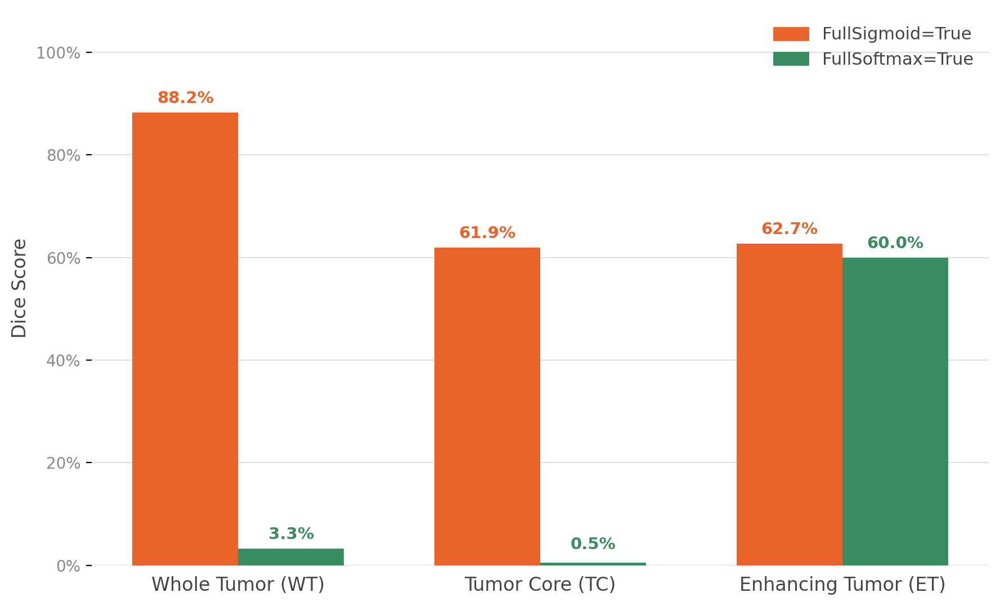

# BrainTumorSeg3D

A PyTorch and MONAI pipeline for **3D multi-modal brain tumor segmentation** on the [BraTS GLI](https://www.synapse.org/#!Synapse:syn59059776) dataset. Four MRI modalities are fused into a 4-channel volume and passed through a MONAI 3D U-Net, which predicts three tumor sub-regions: non-enhancing core (NCR), edema (ED), and enhancing tumor (ET).

## Overview

Gliomas are segmented into clinically relevant regions that are evaluated as **Whole Tumor (WT)**, **Tumor Core (TC)**, and **Enhancing Tumor (ET)**. This project implements the full workflow from data download through training and sliding-window inference on full brain volumes.


| Component            | Details                                         |
| -------------------- | ----------------------------------------------- |
| **Dataset**          | BraTS GLI (1,350 cases), downloaded via Synapse |
| **Modalities**       | T1, T1Gd (contrast-enhanced), T2, FLAIR         |
| **Model**            | 3D U-Net (`monai.networks.nets.UNet`)           |
| **Loss**             | `DiceCELoss` (Dice + cross-entropy)             |
| **Training patches** | `128 × 128 × 128` random crops                  |
| **Inference**        | MONAI sliding-window stitching (`overlap=0.25`) |
| **Hardware**         | Optimized for Apple Silicon (`mps` backend)     |
| **Tracking**         | Weights & Biases                                |


The BraTS benchmark established multimodal MRI tumor segmentation as a standard evaluation setting [[Menze et al., 2015]](#references). Expert segmentation labels for TCGA glioma collections [[Bakas et al., 2017a]](#references) and subsequent BraTS challenge releases [[Baid et al., 2021]](#references) provide the ground truth used in this pipeline.

## Project Structure

```
BrainTumorSeg3D/
├── download_brats.py   # Download BraTS GLI from Synapse
├── data_loader.py      # NIfTI loading and visualization utilities
├── dataset.py          # MONAI transforms, data list, and DataLoader
├── model.py            # 3D U-Net architecture and loss
├── train.py            # Training loop with W&B logging
├── inference.py        # Sliding-window evaluation (Dice on WT/TC/ET)
└── requirements.txt
```

## Data

Each patient directory contains five NIfTI (`.nii.gz`) volumes:


| File suffix | Modality                    | Label value                             |
| ----------- | --------------------------- | --------------------------------------- |
| `t1n`       | Native T1-weighted          | —                                       |
| `t1c`       | Contrast-enhanced T1 (T1Gd) | —                                       |
| `t2w`       | T2-weighted                 | —                                       |
| `t2f`       | FLAIR                       | —                                       |
| `seg`       | Expert segmentation mask    | 0 = background, 1 = NCR, 2 = ED, 3 = ET |


**Evaluation regions** (derived from per-voxel labels):


| Region | Composition          |
| ------ | -------------------- |
| **WT** | NCR ∪ ED ∪ ET        |
| **TC** | NCR ∪ ET             |
| **ET** | Enhancing tumor only |


### Preprocessing

1. Load all four MRI modalities and stack into a single 4-channel tensor.
2. Crop to the non-zero brain foreground (`CropForegroundd`).
3. Z-score normalize non-zero voxels per modality (`NormalizeIntensityd`, channel-wise).
4. **Training:** pad to patch size, then extract random `128³` crops with spatial augmentation.
5. **Validation / inference:** operate on the full cropped volume via sliding-window prediction.

## Model


| Parameter            | Value                                 |
| -------------------- | ------------------------------------- |
| Spatial dimensions   | 3D                                    |
| Input channels       | 4 (MRI modalities)                    |
| Output channels      | 3 (NCR, ED, ET — sigmoid multi-label) |
| Encoder channels     | `(16, 32, 64, 128, 256)`              |
| Downsampling strides | `(2, 2, 2, 2)`                        |
| Optimizer            | AdamW, `lr = 1e-4`                    |
| Epochs               | 30                                    |
| Batch size           | 2                                     |


## Technical Challenges Overcome

**The Activate Function Issue:** Initial training runs used a Mutually Exclusive Softmax activation, which resulted in a severe class imbalance. Since 98% of the brain MRI is empty background and the model utilized 3 output channels (no dedicated background channel), the Softmax constraint forced the network to generate false positives, dropping the Whole Tumor Dice score to 3.2%

**The Solution:** Transitioned the architecture to utilize independent probability mapping using Sigmoid activations. This successfully decoupled the channels, allowing the network to accurately output near-zero probabilities for background voxels. This correction boosted the Whole Tumor Dice score to 88.2%




## Setup

```bash
pip install -r requirements.txt
```

### Download data

Configure Synapse credentials in `.synapseConfig`, then:

```bash
python download_brats.py
```

Data is saved under `./data/training_data1_v2/`.

### Train

```bash
python train.py
```

Checkpoints are written to `brats_unet_mps.pth`. Training metrics are logged to Weights & Biases under the `brats-3d-unet` project.

### Evaluate

```bash
python inference.py
```

Runs sliding-window inference on a held-out validation split (20%, seed 42) and reports mean Dice scores for WT, TC, and ET.

## Results

Evaluated on **270 validation cases** (20% holdout from 1,350 total) using the trained checkpoint and sliding-window inference at a probability threshold of 0.5:


| Region               | Mean Dice |
| -------------------- | --------- |
| Whole Tumor (WT)     | **0.882** |
| Tumor Core (TC)      | 0.619     |
| Enhancing Tumor (ET) | 0.627     |


The model achieves strong whole-tumor overlap (Dice > 0.85) but lower scores on the smaller, harder-to-segment tumor core and enhancing regions. Further improvements could come from longer training, stronger augmentation, mixed-precision optimization, or a self-configuring framework such as nnU-Net.

## References

1. **Menze et al., 2015** — Menze, B. H., Jakab, A., Bauer, S., et al. *The Multimodal Brain Tumor Image Segmentation Benchmark (BRATS).* IEEE Transactions on Medical Imaging, 34(10), 1993–2024, 2015. [doi:10.1109/TMI.2014.2377694](https://doi.org/10.1109/TMI.2014.2377694)
2. **Bakas et al., 2017a** — Bakas, S., Akbari, H., Sotiras, A., et al. *Advancing The Cancer Genome Atlas glioma MRI collections with expert segmentation labels and radiomic features.* Scientific Data, 4, 170117, 2017. [doi:10.1038/sdata.2017.117](https://doi.org/10.1038/sdata.2017.117)
3. **Bakas et al., 2017b** — Bakas, S., Akbari, H., Sotiras, A., et al. *Segmentation labels for the pre-operative scans of the TCGA-GBM collection.* The Cancer Imaging Archive, 2017.
4. **Bakas et al., 2017c** — Bakas, S., Akbari, H., Sotiras, A., et al. *Segmentation labels and radiomic features for the pre-operative scans of the TCGA-LGG collection.* The Cancer Imaging Archive, 286, 2017.
5. **Baid et al., 2021** — Baid, U., Ghodasara, S., Mohan, S., et al. *The RSNA-ASNR-MICCAI BraTS 2021 Benchmark on Brain Tumor Segmentation and Radiogenomic Classification.* arXiv:2107.02314, 2021. [https://arxiv.org/abs/2107.02314](https://arxiv.org/abs/2107.02314)

Full BibTeX entries are provided with the dataset in `data/CITATIONS.bib`.